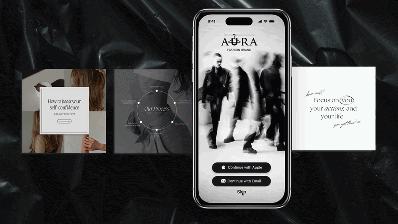

# 👗 Aura: AI-Powered Digital Wardrobe Assistant
### Developed at Apple Developer Academy | Foundation Program

**Aura** is a cutting-edge iOS application designed to revolutionize personal fashion management. Developed during the **Apple Foundation Program**, it combines intuitive UX with on-device AI to help users digitize their closets and style their lives.

## 📺 Project Demo

  
   
  <em>AI-driven background removal and set suggestion in action.</em>

## 🎯 The Vision
The core challenge was to simplify wardrobe organization. Aura solves this by allowing users to take a photo of any garment and instantly transform it into a clean, digital asset. 

## ✨ Key Features
* **AI Background Removal:** Leveraging Apple's **Vision Framework**, Aura automatically detects clothing items and removes complex backgrounds for a professional "boutique" look.
* **Intelligent Set Suggestions:** A smart algorithm that analyzes your digitized collection to suggest stylish combinations.
* **Seamless UX:** Built following Apple’s **Human Interface Guidelines (HIG)** for a native, fluid experience.
* **Privacy First:** All image processing and machine learning tasks are performed **on-device**, ensuring user data never leaves the iPhone.

## ⚙️ Tech Stack
* **Language:** Swift 5.x
* **UI Framework:** SwiftUI
* **AI/ML:** Vision Framework & CoreML (for Image Segmentation).
* **IDE:** Xcode

## 🧠 Development Highlights
As the lead developer for the core logic, I focused on:
1.  **Saliency Detection:** Implementing high-precision masking to isolate garments from real-world backgrounds.
2.  **Adaptive Architecture:** Using a clean SwiftUI architecture to ensure the app is responsive across all iOS devices.
3.  **Data Persistence:** Efficiently managing local storage for a large collection of digitized clothing assets.

---

  Developed with ❤️ at the <strong>Apple Developer Academy</strong>

